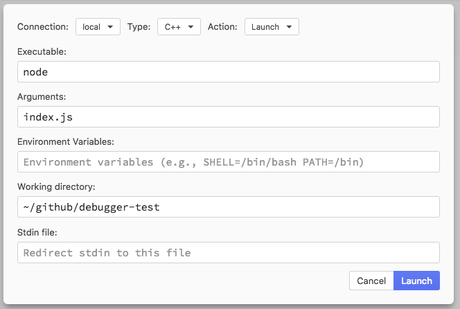

##### Atom and all repositories under Atom will be archived on December 15, 2022. Learn more in our [official announcement](https://github.blog/2022-06-08-sunsetting-atom/)
 #### Setup

1. `npm install`

1. `node-gyp rebuild --debug`

#### Reproduction steps

1. Set a breakpoint at line 13 of `binding.cc`

1. Run `nuclide-debugger:toggle`

1. Configure the debug session like this:

1. Launch the debugger. See that the process exits without stopping at the breakpoint.

#### Workaround

1. Uncomment line 12 (`raise(SIGSTOP)`) of `binding.cc`

1. Run the debugger again

1. See that it stops at the `raise` on line 12 *and* at the breakpoint on line 13.

1. See that it still does not stop at any breakpoint set in `other-file.cc`
